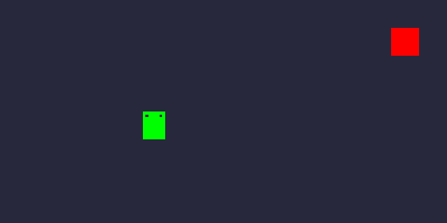
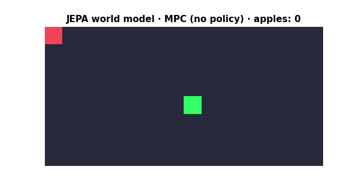
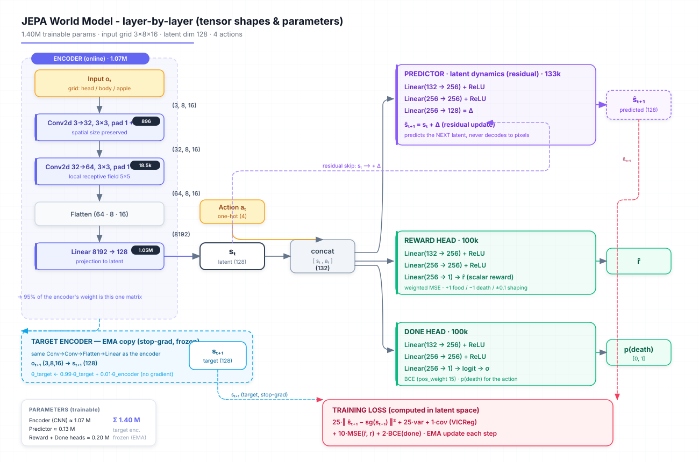
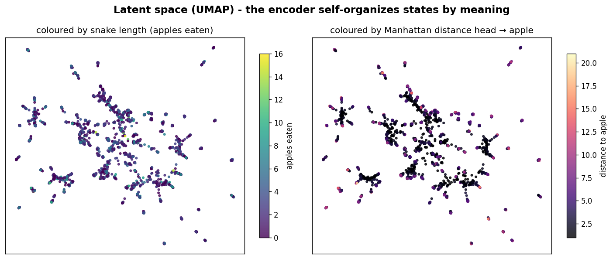
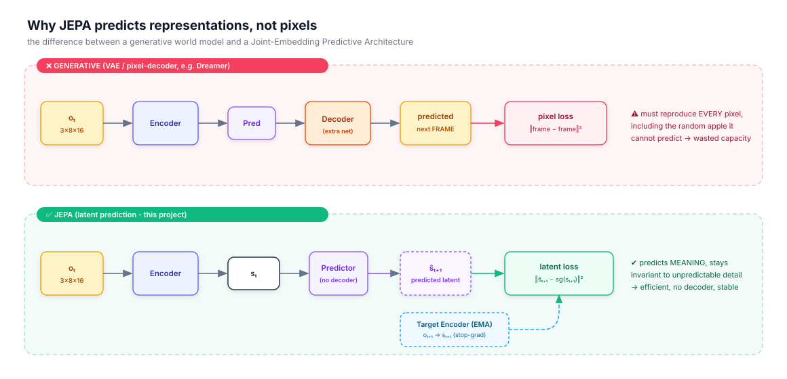
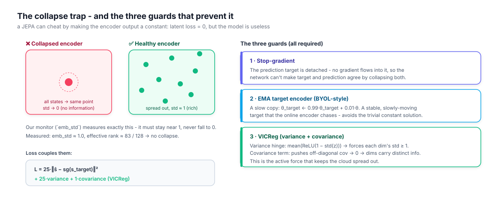
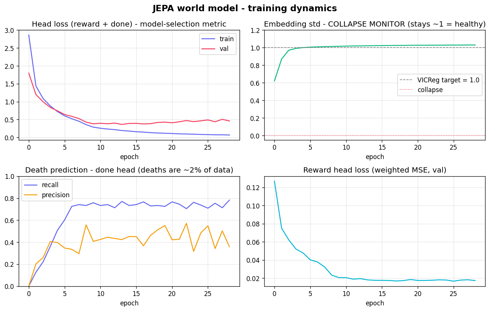
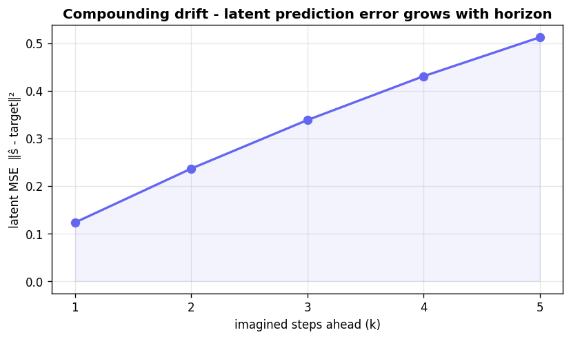
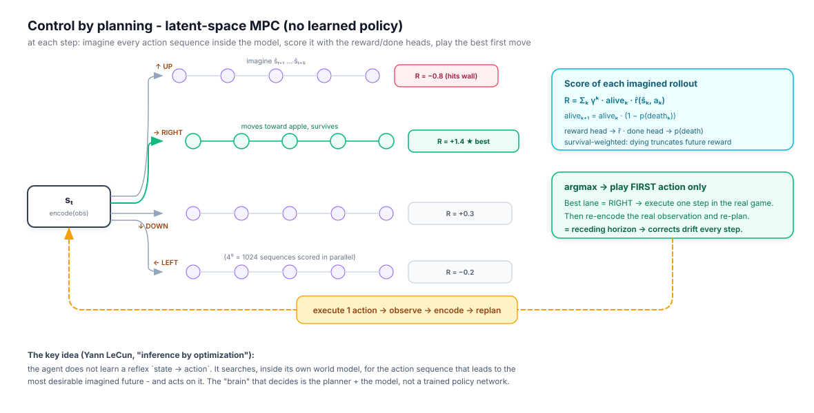
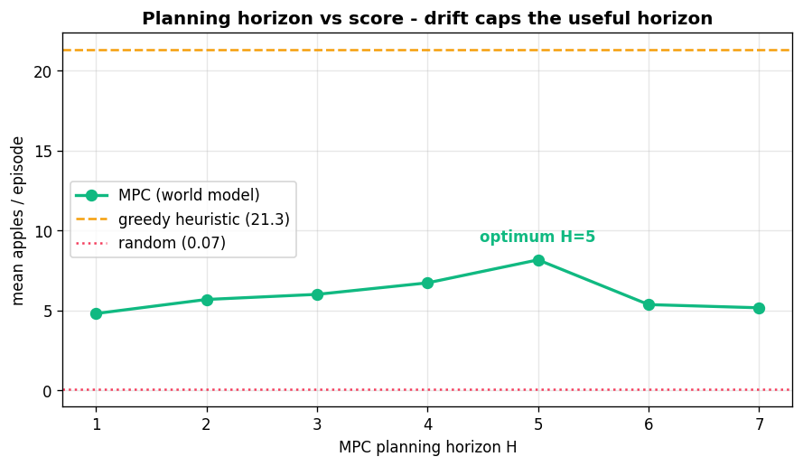

# 🐍🌍 Snake World Model (JEPA) - An AI that Plans in Latent Space


<p align="center">
  
</p>

> 🚨 **Work in progress** - this project is being built from scratch. The game engine works; the world model and the planner are under construction.

---

## 📝 Project Description

This project builds a **world model** in the style of **JEPA (Joint-Embedding Predictive Architecture, Yann LeCun)** from scratch, and uses it to play **Snake**. Unlike my previous Snake agents ([Decision Tree](https://github.com/Thibault-GAREL/AI_snake_decision_tree_version), [NEAT](https://github.com/Thibault-GAREL/AI_snake_genetic_version), [DQN](https://github.com/Thibault-GAREL/AI_snake_DQN_version), [PPO](https://github.com/Thibault-GAREL/AI_snake_PPO_version)), there is **no learned policy here**: the model **imagines the future in latent space** and **plans its own actions** by Model Predictive Control (MPC). The action emerges directly from prediction.

In one sentence: *a mini-Dreamer without a decoder (the predictive block is a JEPA), driven by latent-space search instead of a trained actor.* This is the 6th experiment in my Snake AI series, exploring how an agent can learn the **dynamics** of its world rather than just a reward-maximizing reflex.

This project was created to learn how **self-supervised world models** work, and why predicting **representations** (not pixels) is the key idea behind JEPA.

---

## 🔬 Why a World Model?

> **Can an agent act intelligently without ever learning a policy?**

Every previous agent in my Snake series is **model-free**: NEAT evolves a reflex, the Decision Tree imitates an oracle, DQN learns Q-values, PPO learns an actor. They all learn a direct mapping `state → action`, but **none of them understands the dynamics** of the game - they cannot answer *"what happens if I go right?"*.

A **world model** flips this. It learns the **dynamics** of the environment, so the agent can *imagine* the consequences of its actions and **plan** instead of react. This is at the heart of Yann LeCun's vision of model-based, "System-2" agents that reason by simulation.

The **JEPA** twist is crucial: instead of predicting the next **frame** (pixels), the model predicts the next **representation** (embedding). This makes it robust to detail that is irrelevant or impossible to predict - like the **randomly respawning apple**. A pixel-predicting model would waste capacity trying to guess where the apple lands; a JEPA simply learns to be invariant to it.

**The goal of this project:** show that a Snake agent can play competently with **no trained policy at all**, purely by planning inside a learned latent world model.

---

## ⚙️ Features

  🌍 **JEPA world model** - learns to predict the next state in **latent space**, not in pixels

  🎯 **No trained policy** - the agent acts by **planning (MPC)** through its own imagination

  🖼️ **Raw grid observation** (3 × 8 × 16, channels head / body / apple) - the model learns its own representations

  🪞 **Anti-collapse by design** - target encoder with EMA + stop-gradient + **VICReg** regularization

  🔮 **Multi-step latent rollouts** - the predictor unrolls autoregressively to imagine several moves ahead

  🍎 **Reward + done heads** - the planner maximizes imagined reward while avoiding death

  📈 **MLflow tracking** + a dedicated **collapse monitor** (embedding variance / rank)

  🐍 Built on top of my own [Snake game engine](https://github.com/Thibault-GAREL/snake_game)

---

## Example Outputs

<p align="center">
  
  &nbsp;
  
</p>
<p align="center">
  <sub><b>Left</b> - the original pygame engine (<code>snake.py</code>). &nbsp;&nbsp; <b>Right</b> - the raw <code>3×8×16</code> grid the world model actually <i>sees</i> and plans on (head / body / apple channels).</sub>
</p>

The world model plays Snake **with no learned policy** - every move comes from planning inside its own imagination. Across 30 episodes (planning horizon H=5):

| Agent | Method | Mean score | Max score |
|---|---|---|---|
| Random baseline | - | 0.07 | 1 |
| 🧬 Snake AI - NEAT | Neuroevolution | 10 | 20+ |
| 🌳 Snake AI - Decision Tree | XGBoost + DAgger | 22.77 | 43 |
| 🤖 Snake AI - DQN | Double DQN | 22.60 | 45 |
| 🎯 Snake AI - PPO | Actor-Critic | 38.67 | 64 |
| **🌍 Snake World Model** | **JEPA + MPC (no policy)** | **7.8** | **17** |

> The world model reaches ~110× the random baseline and ~35% of the hand-tuned greedy ceiling (mean 21.3) - a strong result for an agent that **never learned a policy** and only plans inside a self-supervised latent model. The gap to the greedy/RL agents is expected: multi-step latent rollouts drift, which caps the useful planning horizon (H=5 is the measured optimum; H≥6 degrades).

### 📝 Notes & Observations
  🪞 **Representation collapse** is the main JEPA pitfall - the encoder can cheat with a constant output. VICReg + EMA keep the embedding std at ~1.0 (effective rank ≈ 83/128). The collapse monitor confirms it never collapsed.

  🍎 **Dense reward shaping is what makes planning work.** A sparse "+1 only on the apple" reward gives the planner no signal when the apple is beyond the horizon - the agent just wanders. A potential-based proximity reward (±0.1 per cell closer) lifted MPC from **mean 1.1 → 7.8**.

  💀 **Death must be supervised on the true latent, not the predicted one.** Training the reward/done heads on encoded real states (not the drifted rollout latent) raised death recall from ~0.05 to **0.77**.

  📏 **Latent prediction loss is not scale-invariant** - it grows as VICReg expands the latent, so model selection uses the (fixed-scale) reward/done head loss, never the prediction loss.

  🎲 The apple respawns at a **random** position - the only stochasticity, and a strong reason to predict in latent space rather than in pixels.

---

## ⚙️ How it works

  🎮 The Snake game runs **headless** as a Gym-like environment (`reset()` / `step(a)`), giving a raw grid observation.

  👁️ An **encoder** (small CNN) compresses the grid into a latent state `s_t`.

  🔮 A **predictor** imagines the next latent state `ŝ_{t+1}` from `s_t` and an action `a_t`.

  🪞 A **target encoder** (EMA copy, stop-gradient) produces the learning target - the loss is computed **in latent space** (+ VICReg to avoid collapse).

  🍎 Two small heads predict, from the latent state, the **reward** and the **death** of each imagined action.

  🕹️ At play time, the agent **rolls out** the 4 actions (then short sequences) in its imagination, scores each future, and plays the best one - pure planning, no learned policy.

---

## 🗺️ Architecture Diagram

This project uses a custom **action-conditioned JEPA** world model with a latent-space MPC controller:


**Key components:**
- Encoder: small CNN, input `3×8×16` → latent `s_t`
- Predictor: MLP `[s_t, a_t]` → `ŝ_{t+1}`
- Target encoder: EMA of the encoder (stop-gradient)
- Heads: reward (MSE) + done (BCE)
- Loss: `latent prediction + λ·VICReg + reward + done`
- Control: MPC search in latent space (greedy → short-horizon tree / CEM)

---

## 🕸️ Network Architecture

```
        Observation o_t (3×8×16)              Observation o_{t+1} (3×8×16)
                 │                                       │
          Encoder (CNN)                        Target Encoder (EMA, stop-grad)
       3 →[conv]→ 32 →[conv]→ 64                 (slow copy of the encoder)
            → flatten → FC(128)                          │
                 │                                       │
              s_t (128) ───────────┐                s_{t+1} (128)   ← target
                 │                 │                     │
     ┌───────────┼───────────┐     │                     │
     │           │           │     ▼                     │
 Reward Head  Done Head   Predictor: MLP                 │
 [s_t,a]→r̂   [s_t,a]→done [s_t, a_t(one-hot 4)]          │
   (MSE)       (BCE)      → 256 → 256 → ŝ_{t+1}(128)      │
                              │                          │
                              └──── latent loss ‖ŝ_{t+1} − sg(s_{t+1})‖² + λ·VICReg ──┘

  Control (no learned policy):  for each action a → Predictor → score via Reward/Done heads
                                → argmax  (then unroll over a short horizon H)
```

For the **full layer-by-layer breakdown with tensor shapes and parameter counts**:



The encoder and predictor are deliberately small - the grid is only `8×16`, so the whole model is tiny (1.4M params) and trains fast even on a laptop GPU. The interesting engineering is **not** raw capacity but **stability**: keeping the latent space from collapsing (EMA + stop-gradient + VICReg) and keeping multi-step rollouts from drifting (multi-step training + receding-horizon MPC).

<details>
<summary>🧩 Observation tensor - 3 channels × 8 × 16 grid</summary>

The game board is a **16 × 8** grid (800 × 400 px, 50 px cells). The observation is a one-hot-style tensor:

| Channel | Meaning | Values |
| ------- | ------- | ------ |
| 0 | **Head** of the snake | 1 at the head cell, else 0 |
| 1 | **Body** of the snake | 1 on each body cell, else 0 |
| 2 | **Apple** (food) | 1 at the apple cell, else 0 |

This raw grid is **Markovian** (it encodes the full body shape and direction), unlike the 16 hand-crafted distance features used by the NEAT version. The whole point of a world model is to let the **encoder discover its own representation** from this raw input.

### Actions (4)

| # | Action | Constraint |
| - | ------ | ---------- |
| 0 | UP    | 180° turn forbidden (UP↔DOWN) |
| 1 | RIGHT | 180° turn forbidden (LEFT↔RIGHT) |
| 2 | DOWN  | |
| 3 | LEFT  | |

</details>

---

## 🎓 Deep Dive - Theory & Practice

This section explains **how it really works**, concept by concept - the theory, the maths, the intuition, and what it concretely gave on Snake. Each block is self-contained; open the `<details>` for the deeper parts.

---

### 1 · The latent state `sₜ` - learned representations

Everything starts with turning the raw grid into a **vector of numbers that captures the *meaning* of the game state**. That vector is the **latent** `sₜ ∈ ℝ¹²⁸`.

The idea is the same as **word embeddings** in NLP: a single point in a high-dimensional space whose *position* encodes meaning. Two game states that "mean" almost the same thing (snake about to eat, body in the same shape) land **close together**; two very different states land far apart. The network is never told what the 128 dimensions mean - it **discovers** a geometry by itself, through training.

> 🧠 The encoder is a small CNN. Convolutions read **local** patterns ("is there a wall/body next to the head?"); the final `Linear(8192 → 128)` reads the **global** layout (where everything is) and compresses it into `sₜ`.

**In practice**, after training the encoder uses ≈ **83 of its 128 dimensions** (effective rank) - a rich, non-degenerate representation. We can *see* this structure: projecting the 128-D latents of 4 000 real game states down to 2D with **UMAP** reveals that the encoder spontaneously **organizes states by meaning** - it was never told to.

<p align="center">
  
</p>

Each point is one game state. Same map, two colourings: **left** by snake length (apples eaten), **right** by distance from the head to the apple. Nearby points share game semantics - clear evidence the latent encodes *length* and *apple-relative position*, exactly the factors needed to predict reward and death.

<details>
<summary>📄 Code · the Encoder — <code>src/models/model.py</code></summary>

```python
class Encoder(nn.Module):                          # src/models/model.py
    """Small CNN: (B, 3, 8, 16) -> (B, dim)."""
    def __init__(self, in_ch=3, dim=128):
        super().__init__()
        self.conv = nn.Sequential(
            nn.Conv2d(in_ch, 32, kernel_size=3, padding=1), nn.ReLU(inplace=True),
            nn.Conv2d(32, 64, kernel_size=3, padding=1),    nn.ReLU(inplace=True),
        )
        self.proj = nn.Sequential(
            nn.Flatten(),
            nn.Linear(64 * GRID_H * GRID_W, dim),      # 64·8·16 = 8192 -> 128
        )
    def forward(self, x):
        return self.proj(self.conv(x))                # obs (3,8,16) -> sₜ (128)
```
</details>

---

### 2 · JEPA - predict representations, not pixels

A **world model** must predict the future. The crucial design choice is *in what space*.

<p align="center">
  
</p>

- A **generative** world model (VAE, Dreamer's decoder) predicts the **next frame** (pixels). It needs an extra **decoder** network and a pixel-space loss. Problem: it must reproduce *every* pixel - including the **randomly respawning apple**, which is fundamentally unpredictable. It wastes capacity modelling noise.
- A **JEPA** (Joint-Embedding Predictive Architecture, LeCun) predicts the **next representation** `ŝₜ₊₁` and compares it to the embedding of the real next state. **No decoder, no pixels.** It can stay *invariant* to detail it cannot predict.

> The latent loss is computed entirely in embedding space:
> **L_pred = ‖ ŝₜ₊₁ − sg(sₜ₊₁) ‖²**     (sg = stop-gradient)

This single choice is what makes the model efficient and stable on a stochastic game like Snake.

<details>
<summary>📄 Code · prediction stays in latent space — <code>model.py</code> + <code>train.py</code></summary>

```python
# src/models/model.py — predict the NEXT latent, never decode to pixels
def predict(self, s, a):
    return s + self.predictor(self._cat_action(s, a))   # residual, in latent space

# src/models/train.py — the loss is computed entirely on embeddings
s_pred = model.predict(s_pred, a_k)               # ŝ_{k+1}
target = model.encode_target(next_seq[:, k])      # EMA target encoder (stop-grad)
pred_l = pred_l + F.mse_loss(s_pred, target)      # ‖ŝ − sg(s)‖²   (no decoder!)
```
</details>

---

### 3 · The collapse problem & the three guards ⚠️

JEPA has a famous failure mode. If the loss is just "make `ŝₜ₊₁` match `sₜ₊₁`", the network finds a **shortcut**: make the encoder output a **constant** for every input. Then `ŝ = s = constant`, the loss is **0**, and the model has learned **nothing**.

<p align="center">
  
</p>

Three guards, used **together**, make collapse impossible:

> **1 · Stop-gradient** - the target `sₜ₊₁` is detached; no gradient flows through it, so the net can't pull both sides to a constant.
>
> **2 · EMA target encoder** (BYOL) - the target is a *slow copy* of the encoder:
> **θ_target ← 0.99 · θ_target + 0.01 · θ_online**     (updated every step, no gradient)
>
> **3 · VICReg** - a regularizer that actively spreads the embeddings out:
> **variance** = mean(ReLU(1 − std(z)))  forces each dimension's std ≥ 1,
> **covariance** pushes off-diagonal correlations → 0 so dimensions carry distinct information.

**In practice** we monitor the **embedding std** every epoch - it must stay near 1, never fall to 0:

<p align="center">
  
</p>

Top-right panel: `emb_std` climbs from 0.6 to **≈ 1.0** and stays there → **the encoder never collapsed**.

<details>
<summary>📐 Why the prediction loss must NOT drive model selection</summary>

The latent prediction MSE is **not scale-invariant**. When the embeddings are tiny (start of training, `emb_std ≈ 0.05`), `‖ŝ − s‖²` is tiny too - simply because everything is near zero. As VICReg grows the latent to `std ≈ 1`, the same MSE **mechanically grows**. So a model selected on the lowest prediction loss is the **degenerate early one**.

The fix: select the best model on the **reward + done head loss**, whose targets (`+1 / −1` and `0 / 1`) are at a **fixed scale** and therefore comparable across epochs. The prediction quality is instead watched through VICReg health and the drift curve below.

</details>

<details>
<summary>📄 Code · the three anti-collapse guards — <code>model.py</code> + <code>train.py</code></summary>

```python
# src/models/model.py — guard 1 (stop-grad) + guard 2 (EMA target encoder)
self.target_encoder = Encoder(dim=dim)
self.target_encoder.load_state_dict(self.encoder.state_dict())
for p in self.target_encoder.parameters():
    p.requires_grad_(False)                        # stop-gradient (frozen target)

@torch.no_grad()
def ema_update(self, tau=0.99):                    # θ_target ← τ·θ_target + (1−τ)·θ
    for tp, p in zip(self.target_encoder.parameters(), self.encoder.parameters()):
        tp.mul_(tau).add_(p, alpha=1.0 - tau)

# src/models/train.py — guard 3 (VICReg: variance hinge + covariance)
def vicreg_terms(z):
    z = z - z.mean(dim=0)
    std = torch.sqrt(z.var(dim=0) + 1e-4)
    std_loss = torch.mean(F.relu(1.0 - std))        # push each dim's std → 1
    cov = (z.T @ z) / (z.shape[0] - 1)
    cov_loss = off_diagonal(cov).pow(2).sum() / z.shape[1]    # decorrelate dims
    return std_loss, cov_loss, std.mean().detach()           # 3rd value = collapse monitor
```
</details>

---

### 4 · The predictor - learning the dynamics (residual)

The predictor is the "physics engine" of the world model: given the current latent and an action, it predicts the next latent.

> **ŝₜ₊₁ = sₜ + Predictor( [ sₜ , one-hot(aₜ) ] )**

It is **residual**: it predicts only the **change** `Δ`, not the whole next state. On Snake the state barely changes from one step to the next (the snake moves one cell), so `ŝₜ₊₁ ≈ sₜ`. Predicting the small `Δ` is **easier to learn** and **far more stable** when chained over many steps. The action is injected as a **one-hot vector** concatenated to the latent (the "action-conditioned" part).

<details>
<summary>📄 Code · the residual Predictor — <code>src/models/model.py</code></summary>

```python
# src/models/model.py
self.predictor = _mlp(dim + n_actions, hidden, dim)    # [128+4] → 256 → 256 → 128

def _cat_action(self, s, a):                           # action-conditioning
    a_onehot = F.one_hot(a, self.n_actions).to(s.dtype)
    return torch.cat([s, a_onehot], dim=-1)            # (B, 132)

def predict(self, s, a):
    return s + self.predictor(self._cat_action(s, a))  # ŝₜ₊₁ = sₜ + Δ  (residual)
```
</details>

---

### 5 · Multi-step rollouts & compounding drift

To plan, the predictor is applied **autoregressively** - feeding its own output back in, staying in latent space the whole time:

```
sₜ ──Pred(·,aₜ)──► ŝₜ₊₁ ──Pred(·,aₜ₊₁)──► ŝₜ₊₂ ──► … ──► ŝₜ₊H
```

Each step adds a little error, and the errors **accumulate** - this is **compounding drift**. We measured it directly:

<p align="center">
  
</p>

Two mechanisms keep it under control:

  🔁 **Multi-step training** - during training the predictor is unrolled over `K=5` steps and **every** `ŝ` is supervised, so the model learns to stay stable on its *own* predictions (à la Dreamer / TD-MPC), not just on ground-truth states.

  🪟 **Receding-horizon MPC** - at play time the agent plans `H` steps but executes only the **first**, then re-encodes the *real* observation and re-plans. Drift is reset every step.

  🎲 **Intrinsic limit** - as long as a rollout doesn't *eat* an apple, the dynamics are deterministic and prediction stays sharp. After a meal the new apple is random, so the far future is fundamentally blurry - the planner aims at the **current** apple with a short horizon.

<details>
<summary>📄 Code · the K-step unroll — <code>src/models/train.py</code></summary>

```python
# src/models/train.py — unroll K steps autoregressively, supervise EVERY step
s_pred = model.encode(obs0)
s_true = s_pred
for k in range(cfg.ROLLOUT_K):                    # K = 5
    a_k = actions[:, k]
    # ... reward / done heads applied on s_true (see §6) ...
    s_pred = model.predict(s_pred, a_k)           # ŝ_{k+1} = Pred(ŝ_k, a_k)
    target = model.encode_target(next_seq[:, k])
    pred_l = pred_l + F.mse_loss(s_pred, target)  # supervise each step → less drift
    if k < cfg.ROLLOUT_K - 1:
        s_true = model.encode(next_seq[:, k])     # true latent for the next step
```

The `Split` class (same file) only samples windows that **never cross an episode boundary**, so a rollout never mixes two games.
</details>

---

### 6 · Reward & done heads - judging an imagined future

Predicting the future is not enough; the agent must know which future is *good*. Two small heads read the latent and predict:

- **Reward head** → `r̂` (a scalar) - trained by **MSE** (regression).
- **Done head** → `p(death)` - trained by **BCE** (binary classification).

> ⚠️ **Deaths are rare (~2 % of transitions).** A model that always predicts "alive" is **98 % accurate** and completely useless - the classic class-imbalance trap. We therefore (a) weight the BCE with a **`pos_weight`** so rare deaths count more, and (b) report **recall / precision / F1**, never accuracy.

A second subtlety mattered a lot: the heads are supervised on the **true encoded latent** of each state, **not** on the drifted rollout latent `ŝ`. Deaths happen at the end of a window, exactly where `ŝ` has drifted most - supervising there taught the model almost nothing. Switching to the true latent lifted **death recall from 0.05 → 0.77** (bottom-left panel of the training plot above).

<details>
<summary>📄 Code · reward / done heads + balanced supervision — <code>model.py</code> + <code>train.py</code></summary>

```python
# src/models/model.py — two small heads on [sₜ, aₜ]
self.reward_head = _mlp(dim + n_actions, hidden, 1)    # → r̂    (regression, MSE)
self.done_head   = _mlp(dim + n_actions, hidden, 1)    # → logit (classification, BCE)

# src/models/train.py — supervised on the TRUE encoded latent s_true (not the drifted ŝ)
r_pred, r_tgt = model.reward(s_true, a_k), rewards[:, k]
w = 1.0 + cfg.REWARD_EVENT_WEIGHT * (r_tgt.abs() > 0.5).float()   # food/death weighted ×6
rew_l  = rew_l  + (w * (r_pred - r_tgt) ** 2).mean()
logit  = model.done_logit(s_true, a_k)
done_l = done_l + F.binary_cross_entropy_with_logits(
    logit, dones[:, k], pos_weight=pos_weight)         # pos_weight fights the ~2% imbalance
```
</details>

---

### 7 · Reward shaping - dense guidance for planning

This was the single change that made the agent actually *play*.

With a **sparse** reward ("+1 only when you land on the apple"), a short-horizon planner gets **zero signal** whenever the apple is more than `H` steps away - so it just wanders until it dies. The fix is **potential-based reward shaping**: a small dense reward for every step that gets **closer** to the apple.

> **r_shaping = 0.1 × ( dist(headₜ, apple) − dist(headₜ₊₁, apple) )**     (Manhattan distance)

This gives the planner a gradient toward the apple at **every** step, even far away. The effect was dramatic:

> **MPC mean score: 1.1  →  7.8**   just by adding shaping.

It is "potential-based", so it provably **does not change the optimal policy** - it only makes the signal dense. (This is the same trick the [PPO Snake agent](https://github.com/Thibault-GAREL/AI_snake_PPO_version) used.)

<details>
<summary>📄 Code · potential-based shaping — <code>src/envs/snake_env.py</code></summary>

```python
# src/envs/snake_env.py — inside step()
prev_dist = self._apple_dist(hx, hy)              # distance BEFORE the move
...
else:                                             # a normal step (snake didn't eat)
    self.snake.pop()
    reward = R_STEP + self.shaping * (prev_dist - self._apple_dist(nx, ny))
    #                  └ +0.1 per cell closer to the apple, −0.1 per cell further
```
</details>

---

### 8 · Planning by inference - the MPC controller 🕹️

Here is the payoff: **the world model acts with no learned policy at all.**

<p align="center">
  
</p>

At each real step, the controller:
1. **encodes** the observation → `sₜ`,
2. **imagines** every action sequence of length `H` inside the latent model (an exhaustive `4ᴴ` search, fully vectorized on GPU),
3. **scores** each imagined rollout with the reward/done heads, weighting future reward by the probability of still being alive:

> **R = Σₖ γᵏ · aliveₖ · r̂(ŝₖ, aₖ)**,   with   **aliveₖ₊₁ = aliveₖ · (1 − p(deathₖ))**

4. plays the **first** action of the best sequence, then re-encodes and re-plans (**receding horizon**).

This is exactly Yann LeCun's **"inference by optimization"**: the agent doesn't learn a reflex `state → action`; it **searches**, inside its own world model, for the actions leading to the most desirable imagined future. The decision-maker is *the planner + the model*, not a policy network.

**How deep can it plan?** The drift (section 5) caps the useful horizon. We swept `H` and measured it:

<p align="center">
  
</p>

The score rises with `H`, peaks at **H = 5** (mean ≈ 8 apples), then *drops* for `H ≥ 6` - beyond 5 steps the imagined latent has drifted too far to be trustworthy. A perfect illustration of the prediction/planning trade-off.

<details>
<summary>📄 Code · the MPC controller — <code>src/models/planner.py</code></summary>

```python
# src/models/planner.py — imagine every 4^H sequence, score, take the argmax
@torch.no_grad()
def act(self, obs):
    s = self.model.encode(...).expand(M, -1)      # M = 4^H rollouts, scored in parallel
    alive, ret, g = torch.ones(M), torch.zeros(M), 1.0
    for k in range(self.horizon):
        a_k = self.seqs[:, k]
        r = self.model.reward(s, a_k)
        d = torch.sigmoid(self.model.done_logit(s, a_k))
        ret   = ret + g * alive * r               # survival-weighted return
        alive = alive * (1.0 - d)                 # dying truncates future reward
        s = self.model.predict(s, a_k)            # roll the latent forward
        g *= self.gamma
    best = int(torch.argmax(ret))
    return int(self.seqs[best, 0])                # execute only the FIRST action
```
</details>

---

## ⚙️ Key Hyperparameters

> Values used in the trained run (all centralized in [`src/config.py`](src/config.py)).

| Parameter            | Value                          | Description                                          |
| -------------------- | ------------------------------ | ---------------------------------------------------- |
| `embedding_dim`      | 128                            | Size of the latent state `s_t`                       |
| `encoder`            | CNN 3→32→64 → FC(128)          | Grid encoder (1.4M params total)                     |
| `predictor`          | MLP [128+4] → 256 → 256 → 128  | Latent dynamics model (residual)                     |
| `EMA_decay` (τ)      | 0.99                           | Target encoder slow update                           |
| `VICReg` (pred/std/cov) | 25 / 25 / 1                 | Anti-collapse: prediction + variance + covariance    |
| `reward / done coef` | 10 / 2                         | Head weights (reward event-weighted ×5)              |
| `done pos_weight`    | 15 (capped)                    | Class-balanced BCE (deaths are ~2%)                  |
| `optimizer`          | AdamW (LR 3e-4, wd 1e-4)       | + gradient clip 1.0, early stopping on head loss     |
| `batch_size`         | 256                            | Transitions per gradient step                        |
| `train_rollout_K`    | 5                              | Multi-step unroll length during training             |
| `MPC_horizon_H`      | **5**                          | Planning depth at play time (best by horizon sweep)  |
| `GAMMA`              | 0.99                           | Discount used when scoring imagined rollouts         |
| `device`             | `cuda` if available            | Tiny model - CPU also works                          |

### 🍎 Reward definition (predicted by the Reward / Done heads)

| Event                | Reward |
| -------------------- | ------ |
| Food eaten           | +1.0   |
| Death (wall or body) | −1.0   |
| Step toward / away from apple | ±0.1 × Manhattan distance change *(dense potential-based guidance)* |

The reward and termination are **not** given to the planner by the real game - they are **predicted** from the latent state by the reward/done heads, so the agent plans entirely inside its own world model. The dense shaping term is essential: it is what lets the short-horizon planner steer toward apples that are still out of sight.

---

## 📊 Comparison - 5 Snake AI approaches

This project is part of a series of **5 Snake AI implementations** using different AI paradigms on the same game. The first four are **model-free** (they learn a policy / value); this one is the first **model-based** agent (it learns the dynamics and plans).

| Aspect | 🧬 [NEAT](https://github.com/Thibault-GAREL/AI_snake_genetic_version) | 🌳 [Decision Tree](https://github.com/Thibault-GAREL/AI_snake_decision_tree_version) | 🤖 [DQL (DQN)](https://github.com/Thibault-GAREL/AI_snake_DQN_version) | 🎯 [PPO](https://github.com/Thibault-GAREL/AI_snake_PPO_version) | 🌍 World Model ← |
| --- | --- | --- | --- | --- | --- |
| **Paradigm** | Evolutionary | Imitation Learning | Reinforcement Learning | Reinforcement Learning | Self-supervised + planning |
| **Algorithm type** | Neuroevolution | Supervised (XGBoost + DAgger) | Off-policy (Q-learning) | On-policy (Actor-Critic) | World model (JEPA + MPC) |
| **Architecture** | 16 → ~28 hidden (final, evolved) → 4 | 26 → 1 600 trees (400×4) → 4 | 28 → 256 → 256 → 128 → 4 | 28 → 256 → 256 → {128→4 (π), 128→1 (V)} | 3×8×16 → CNN → 128 latent → MLP predictor + reward/done heads |
| **Model complexity** | ~200–500 params (evolves) | ~80k–200k decision nodes | ~140k params | ~145k params | ~1.4M params |
| **Exploration** | Genetic mutations + speciation | DAgger oracle (β : 0.8 → 0.05) | ε-greedy (1.0 → 0.01) | Entropy bonus (coef 0.05) | ε-greedy data collection (offline) + MPC search |
| **Memory / Buffer** | Population (100 genomes) | Supervised buffer (300 000) | Experience Replay (100 000) | Rollout buffer (2 048 steps) | Transition dataset (100 000) |
| **Batch** | ❌ (full population eval.) | Full dataset per round | 128 | 64 | 256 |
| **Training time** | **~15 h** | **~12 min (GPU)** | **~2.5 h (GPU)** | **~3 h (GPU)** | **~1 min (GPU)** |
| **Max score** | **> 20** | **43** | **45** | **64** | **17** |
| **Mean score** | **10** | **22.77** | **22.60** | **38.67** | **7.8** |
| **GPU support** | ❌ | ✅ | ✅ | ✅ | ✅ |
| **Sample efficiency** | 🔴 Low | 🟢 High | 🟡 Medium | 🔴 Low | 🟢 High (model-based) |
| **Generalization** | 🟡 Medium | 🔴 Low | 🟡 Medium | 🟢 High | 🟢 High (raw grid + dynamics) |
| **Intrinsic interpretability** | 🟡 Low | 🟡 Medium (ensemble = grey box) | 🔴 Black box | 🔴 Black box | 🟡 Medium (latent opaque, but imagined rollouts + reward/done are inspectable) |

> ← = current repository. The World Model scores lower than the RL agents but is the only one that **never learns a policy** - it plays purely by planning - and trains in a fraction of the time.

---

## 📂 Repository structure

```bash
├── assets/                       # Images, diagrams & plots for the README
│   ├── Logo_World_Model_from_scratch.png
│   ├── architecture-jepa.svg            # high-level data flow
│   ├── architecture-detailed.svg        # layer-by-layer with shapes
│   ├── concept-jepa-vs-generative.svg   # theory diagrams
│   ├── concept-anti-collapse.svg
│   ├── concept-mpc-planning.svg
│   ├── snake_gameplay.gif               # agent in the pygame engine (generated)
│   ├── mpc_gameplay.gif                 # agent in the raw grid view (generated)
│   ├── plot_training.png                # generated from real runs
│   ├── plot_drift.png
│   ├── plot_horizon.png
│   └── latent_umap.png
│
├── snake.py                      # Original Snake game engine (Pygame + NEAT-ready)
│
├── src/
│   ├── config.py                 # Pydantic config: all hyperparameters + paths + MLflow
│   ├── envs/
│   │   └── snake_env.py          # Headless Gym-like env (reset/step), grid obs + shaping
│   ├── data/
│   │   └── make_dataset.py       # Generates (o_t, a_t, r_t, done, o_t+1) trajectories
│   ├── models/
│   │   ├── model.py              # Encoder, Predictor, TargetEncoder, Reward/Done heads
│   │   ├── train.py              # JEPA loss + VICReg + EMA + multi-step + MLflow
│   │   └── planner.py            # Latent-space MPC controller (the agent)
│   └── validation/
│       ├── metrics.py            # Collapse monitor, drift, head quality, agent eval
│       └── plots.py              # Generates the README figures from artifacts
│
├── data/                         # 1-raw / 2-processed / 3-external
├── outputs/                      # models / logs / results (+ MLflow)
├── tests/                        # test_env.py, test_model.py
│
├── CLAUDE.md
├── LICENSE
└── README.md
```

---

## 💻 Run it on Your PC
Clone the repository and install dependencies:
```bash
git clone https://github.com/Thibault-GAREL/World-model-Snake.git
cd World-model-Snake

python -m venv .venv # if you don't have a virtual environment
source .venv/bin/activate   # Linux / macOS
.venv\Scripts\activate      # Windows

pip install torch numpy pygame mlflow pydantic-settings tqdm matplotlib
```

⚠️ You need a **CUDA-compatible GPU** for fast training (the model is tiny, so CPU also works).

### Full pipeline
```bash
python -m src.data.make_dataset     # 1. collect transitions -> data/2-processed
python -m src.models.train          # 2. train the JEPA world model (~1 min on GPU)
python -m src.validation.metrics    # 3. evaluate: collapse, drift, heads, MPC vs baselines
python -m src.models.planner        # 4. watch the agent play (MPC, no policy)
```

### Reproduce the README figures
```bash
python -m src.validation.plots      # training curves, drift, horizon sweep -> assets/
mlflow ui                           # browse all runs at http://localhost:5000
```

---

## 📖 Inspiration / Sources
This project is based on:
- 📄 [World Models - Ha & Schmidhuber (2018)](https://arxiv.org/abs/1803.10122)
- 📄 [A Path Towards Autonomous Machine Intelligence - LeCun (2022)](https://openreview.net/forum?id=BZ5a1r-kVsf)
- 📄 [I-JEPA - Assran et al. (2023)](https://arxiv.org/abs/2301.08243)
- 📄 [V-JEPA 2 - Meta AI (2025)](https://arxiv.org/abs/2506.09985)
- 📄 [VICReg - Bardes et al. (2022)](https://arxiv.org/abs/2105.04906)
- 📄 [DreamerV3 - Hafner et al. (2023)](https://arxiv.org/abs/2301.04104)
- 📄 [TD-MPC2 - Hansen et al. (2024)](https://arxiv.org/abs/2310.16828)

Part of my **Snake AI series**:
- 🐍 [Snake game (engine)](https://github.com/Thibault-GAREL/snake_game)
- 🧬 [Snake AI - GA (NEAT)](https://github.com/Thibault-GAREL/AI_snake_genetic_version)
- 🌳 [Snake AI - Decision Tree](https://github.com/Thibault-GAREL/AI_snake_decision_tree_version)
- 🤖 [Snake AI - DQN](https://github.com/Thibault-GAREL/AI_snake_DQL_version)
- 🎯 [Snake AI - PPO](https://github.com/Thibault-GAREL/AI_snake_PPO_version)

Code created by me 😎, Thibault GAREL - [Github](https://github.com/Thibault-GAREL)
