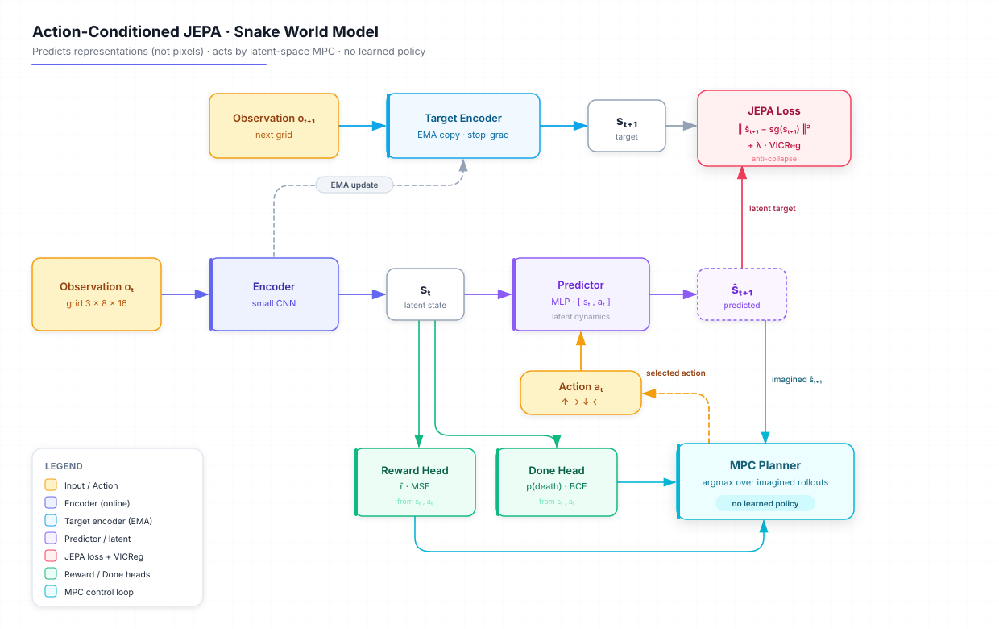

# 🐍🧠 Snake World Model (JEPA) - An AI that Plans in Latent Space


<p align="center">
  
</p>

> 🚨 **Work in progress** - this project is being built from scratch. The game engine works; the world model and the planner are under construction.

---

## 📝 Project Description

This project builds a **world model** in the style of **JEPA (Joint-Embedding Predictive Architecture, Yann LeCun)** from scratch, and uses it to play **Snake**. Unlike my previous Snake agents (NEAT, DQN, PPO), there is **no learned policy here**: the model **imagines the future in latent space** and **plans its own actions** by Model Predictive Control (MPC). The action emerges directly from prediction.

In one sentence: *a mini-Dreamer without a decoder (the predictive block is a JEPA), driven by latent-space search instead of a trained actor.* This is the 6th experiment in my Snake AI series, exploring how an agent can learn the **dynamics** of its world rather than just a reward-maximizing reflex.

This project was created to learn how **self-supervised world models** work, and why predicting **representations** (not pixels) is the key idea behind JEPA.

---

## ⚙️ Features

  🧠 **JEPA world model** - learns to predict the next state in **latent space**, not in pixels

  🎯 **No trained policy** - the agent acts by **planning (MPC)** through its own imagination

  🖼️ **Raw grid observation** (3 × 8 × 16, channels head / body / apple) - the model learns its own representations

  🪞 **Anti-collapse by design** - target encoder with EMA + stop-gradient + **VICReg** regularization

  🍎 **Reward + done heads** - the planner maximizes imagined reward while avoiding death

  📈 **MLflow tracking** + a dedicated **collapse monitor** (embedding variance / rank)

  🐍 Built on top of my own [Snake game engine](https://github.com/Thibault-GAREL/snake_game)

---

## Example Outputs

> 🚨 Training not finished yet - benchmark table coming soon.

Planned comparison against the rest of my Snake AI series:

| Agent | Method | Mean score | Max score |
|---|---|---|---|
| Snake AI - GA | NEAT | 20+ | - |
| Snake AI - DQN | Double DQN | - | - |
| Snake AI - PPO | Actor-Critic | 38.67 | 64 |
| **Snake World Model** | **JEPA + MPC** | *coming* | *coming* |

### 📝 Notes & Observations
  🪞 The hardest part of JEPA is **representation collapse** - the encoder can cheat by outputting a constant. Watch embedding variance closely.

  🎲 The apple respawns at a **random** position - the only source of stochasticity, and a strong reason to predict in latent space rather than in pixels.

---

## ⚙️ How it works

  🎮 The Snake game runs **headless** as a Gym-like environment (`reset()` / `step(a)`), giving a raw grid observation.

  👁️ An **encoder** (small CNN) compresses the grid into a latent state `s_t`.

  🔮 A **predictor** imagines the next latent state `ŝ_{t+1}` from `s_t` and an action `a_t`.

  🪞 A **target encoder** (EMA copy, stop-gradient) produces the learning target - the loss is computed **in latent space** (+ VICReg to avoid collapse).

  🍎 Two small heads predict, from the latent state, the **reward** and the **death** of each imagined action.

  🕹️ At play time, the agent **rolls out** the 4 actions (then short sequences) in its imagination, scores each future, and plays the best one - pure planning, no learned policy.

---

## 🗺️ Architecture Diagram

This project uses a custom **action-conditioned JEPA** world model with a latent-space MPC controller:



**Key components:**
- Encoder: small CNN, input `3×8×16` → latent `s_t`
- Predictor: MLP `[s_t, a_t]` → `ŝ_{t+1}`
- Target encoder: EMA of the encoder (stop-gradient)
- Heads: reward (MSE) + done (BCE)
- Loss: `latent prediction + λ·VICReg + reward + done`
- Control: MPC search in latent space (greedy → short-horizon tree / CEM)

---

## 📂 Repository structure
```bash
├── assets/                       # Images & diagram for the README
│   ├── demo.gif
│   └── architecture-jepa.svg
│
├── snake.py                      # Original Snake game engine (Pygame + NEAT-ready)
│
├── src/
│   ├── config.py                 # Pydantic config (paths, seed, MLflow)
│   ├── envs/
│   │   └── snake_env.py          # Headless Gym-like env (reset/step), grid observation
│   ├── data/
│   │   └── make_dataset.py       # Generates (o_t, a_t, r_t, done, o_t+1) trajectories
│   ├── models/
│   │   ├── model.py              # Encoder, Predictor, TargetEncoder, Reward/Done heads
│   │   ├── train.py              # JEPA training loop + EMA + MLflow logging
│   │   └── planner.py            # Latent-space MPC controller
│   └── validation/
│       └── metrics.py            # Prediction error, reward/done acc, collapse monitor
│
├── data/                         # 1-raw / 2-processed / 3-external
├── outputs/                      # models / logs / results
├── tests/
│
├── CLAUDE.md
├── LICENSE
└── README.md
```

---

## 💻 Run it on Your PC
Clone the repository and install dependencies:
```bash
git clone https://github.com/Thibault-GAREL/World-model-Snake.git
cd World-model-Snake

python -m venv .venv # if you don't have a virtual environment
source .venv/bin/activate   # Linux / macOS
.venv\Scripts\activate      # Windows

pip install torch numpy pygame mlflow pydantic-settings tqdm
```

⚠️ You need a **CUDA-compatible GPU** for fast training (the model is tiny, so CPU also works).

### Generate the dataset
```bash
python -m src.data.make_dataset
```

### Train the world model
```bash
python -m src.models.train
```

### Watch the agent play
```bash
python -m src.models.planner
```

---

## 📖 Inspiration / Sources
This project is based on:
- 📄 [World Models - Ha & Schmidhuber (2018)](https://arxiv.org/abs/1803.10122)
- 📄 [A Path Towards Autonomous Machine Intelligence - LeCun (2022)](https://openreview.net/forum?id=BZ5a1r-kVsf)
- 📄 [I-JEPA - Assran et al. (2023)](https://arxiv.org/abs/2301.08243)
- 📄 [V-JEPA 2 - Meta AI (2025)](https://arxiv.org/abs/2506.09985)
- 📄 [VICReg - Bardes et al. (2022)](https://arxiv.org/abs/2105.04906)

Part of my **Snake AI series**:
- 🐍 [Snake game (engine)](https://github.com/Thibault-GAREL/snake_game)
- 🧬 [Snake AI - GA (NEAT)](https://github.com/Thibault-GAREL/AI_snake_genetic_version)
- 🧠 [Snake AI - DQN](https://github.com/Thibault-GAREL/AI_snake_DQL_version)
- 🎯 [Snake AI - PPO](https://github.com/Thibault-GAREL/AI_snake_PPO_version)
- 🌳 [Snake AI - Decision Tree](https://github.com/Thibault-GAREL/AI_snake_decision_tree_version)

Code created by me 😎, Thibault GAREL - [Github](https://github.com/Thibault-GAREL)
# World_model_from_scratch-Snake
